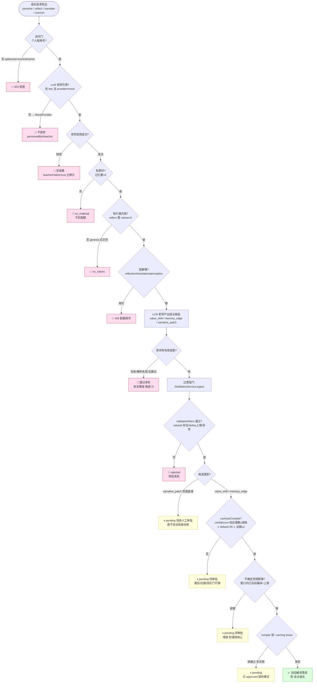

# 数字人格自主学习：停止逻辑与成长治理

> 本文回答两个问题：(1) 数字人格在自主学习时**什么情况下会停止**（流程图）；(2) **哪些 persona 该让自动成长更激进/更保守，如何量化**。
>
> 所有阈值/字段引用自代码（`core-update-gate.ts` / `distillation-service.ts` / `llm-reflection-distiller.ts` / `me.ts`），非臆测。ADR-0047（零-LLM 内核 + 蒸馏成长）+ ADR-0048（成长治理）。

---

## 一、核心原则（先讲清，否则流程图会误读）

**数字人格不会"后台永不停地自己学"。** 运行时（chat）是纯零-LLM 只读——它**只在被显式触发**时学：

| 学习档 | 触发方式 | 是否调 LLM 老师 |
| --- | --- | --- |
| `perceive` | 被教（POST /perceive，看视频/听音频/读文字） | 是（感官老师） |
| `reflect` | 自己内化（POST /reflect，反思已学记忆） | 是（反思老师） |
| `earning/autorun` | 自主劳动完成后触发内化 | 是 |
| `translate` | 内容多语翻译（POST /translate） | 是 |
| `chat` | 对话 | **否（纯只读，根本不学）** |

所以生产里最常见的"停止"其实是**第 0 种：没人触发**——它默认是被动等触发的。下面的流程图覆盖"被触发后"的全部停止点。

---

## 二、停止逻辑流程图

### 停止点分四类

| 类别 | 停止点 | 含义 | 代码 |
| --- | --- | --- | --- |
| **前置门槛**（还没开始） | 访问门 / 老师不可用 / 老师调用失败 / 配额用尽 | 没资格、没老师、没额度 | `assertCompanionAccess`、`perception-provider-factory`、`QuotaManager` |
| **无原料**（没东西学） | `no_material` / `no_values` | 空记忆 / 无价值内核 | `me.ts:309/324`、`llm-reflection-distiller.ts:87` |
| **治理刹车**（学太快被拦） | 不确定性预算超额 → 降人工审批 | 窗口内吸收太多未验证成长 | `distillation-service.ts:124` |
| **蒸馏门拦截**（候选没被接受） | `rejected` / `pending`（narrative 恒待审批 / 置信不够 / 信任门 / 锁被占） | 校验不过 或 不够格自动编译 | `core-update-gate.ts`、`DistillationService` |

---

## 三、关键阈值（代码现值）

| 参数 | 默认值 | 作用 | 可 per-persona 覆盖? |
| --- | --- | --- | --- |
| `distilledValueShiftMinConfidence` | **0.8** | value_shift 自动编译最低置信 | ❌ 全局 |
| `distilledValueShiftMaxDelta` | **0.05** | value_shift 单次最大漂移 | ❌ 全局 |
| `distilledMemoryEdgeMinConfidence` | **0.75** | memory_edge 自动编译最低置信 | ❌ 全局 |
| `distilledMemoryEdgeMinEvidence` | **2** | memory_edge 最少证据条数 | ❌ 全局 |
| `MAX_REFLECTION_DELTA`（反思侧） | **0.05** | 单周期单价值净漂移上限 | ❌ 常量 |
| `trustTierConfidenceMultiplier` | internal **1.0** / semi **1.1** / external **1.25** | 来源信任分级——外部输入门槛更高 | ❌ 全局 |
| `unverifiedGrowthWindowMs` | **86_400_000（24h）** | 不确定性预算的时间窗口 | ❌ 全局 |
| **`unverifiedGrowthBudgetPerWindow`** | **`Number.MAX_SAFE_INTEGER`（默认不限）** | 窗口内自动编译未验证成长的上限，超额降人工审批 | **✅ 唯一可 per-persona 覆盖** |

> **信任分级的实际效果**：`external/perception` 来源（外部感知输入）要 `confidence ≥ 0.75×1.25 = 0.9375 ∧ evidence ≥ 2` 才自动编译——比 `reflection`（internal，×1.0）显著更难。**外部输入天然更保守**，这是设计意图（外部不可信）。

---

## 四、哪些 persona 该更激进/更保守 + 量化建议

### 4.1 当前唯一可调的阀门

目前 per-persona 唯一能覆盖的治理字段是 **`unverifiedGrowthBudgetPerWindow`**（24h 窗口内自动编译的未验证成长条数上限）。**这是控制"激进 vs 保守"的主旋钮**：
- **小预算** = 保守：很快达上限 → 后续成长降人工审批 → 自动成长慢、稳。
- **大预算 / 不限** = 激进：自动吸收快、人工介入少。

### 4.2 按 archetype 的量化建议

4 个出生原型（`personality-archetypes.ts`）天然对应不同的风险偏好，建议把它映射到预算：

| Archetype | 风险特质（出生维度） | 自动成长倾向 | **建议 `unverifiedGrowthBudgetPerWindow`（条/24h）** | 理由 |
| --- | --- | --- | --- | --- |
| **explorer 探索者** | explorationBias↑ riskAppetite↑ | **最激进** | **20** | 大胆试新、容错——快速吸收新经验是它的本色 |
| **doer 行动者** | riskAppetite↑ deliberationDepth↓ | 激进 | **15** | 快速行动、当下导向，但不如 explorer 爱试新 |
| **analyst 分析师** | deliberationDepth↑ regretSensitivity↑ | 保守 | **6** | 深思、怕错——多让人工把关，宁慢勿误 |
| **guardian 守护者** | riskAppetite↓ lossAversion↑ | **最保守** | **3** | 规避损失、谨慎——核心人格稳定优先 |
| （未选原型/默认） | — | 中性 | **10** | 居中的稳妥默认 |

> 这些数字是**起点建议**，不是教条。量化口径：以"一条管理课 perceive 蒸馏出约 5–8 条记忆 + 反思每轮约 2–3 条自动编译"估算，guardian=3 意味着**一天内自动落库不超过 3 条未验证成长**，其余排队人工审批；explorer=20 则基本放开。

### 4.3 是否可量化 —— 可以，且建议引入"激进度"单一标量

为避免每个 persona 手调 7 个字段，建议引入一个 **`growthAggressiveness ∈ [0,1]`** 单标量（产品/治理侧只调它），由它**确定性派生**各阀门：

| 派生字段 | 保守端 (aggr=0) | 激进端 (aggr=1) | 派生公式（线性插值） |
| --- | --- | --- | --- |
| `unverifiedGrowthBudgetPerWindow` | 2 | 30 | `round(2 + 28·aggr)` |
| `distilledValueShiftMinConfidence`（若放开 per-persona） | 0.90 | 0.70 | `0.90 − 0.20·aggr` |
| `distilledMemoryEdgeMinConfidence` | 0.85 | 0.65 | `0.85 − 0.20·aggr` |
| `external 信任乘数` | 1.5（更难） | 1.1（更易） | `1.5 − 0.4·aggr` |

archetype → aggressiveness 映射：explorer **0.85** / doer **0.65** / 默认 **0.5** / analyst **0.3** / guardian **0.15**。

> **守住红线**：无论多激进，**两条永不放开**——(1) `narrative_patch`（改"我是谁"）**恒人工审批**；(2) `MAX_REFLECTION_DELTA=0.05` 单次漂移上限（学得再多，一次只能微调）。激进度只放宽"自动 vs 审批"的门，不放宽"一次能改多少"。

---

## 五、落地路径（若要实现 4.3）

当前只有 `unverifiedGrowthBudgetPerWindow` 可 per-persona 覆盖。要做完整的"激进度单标量"需：
1. 把其余阀门（confidence/multiplier）从全局 policy 改为可 per-persona 覆盖（`PersonaGovernanceOverride` 扩字段 + `budgetResolver` 同款 resolver）。
2. 出生时按 archetype 派生默认 aggressiveness → 落 governance override（仿 personalitySeed 出生扰动）。
3. 治理 API/Console 暴露 `growthAggressiveness` 单滑块（而非 7 个字段）。

> 本文是**设计与建议**，未改代码。若要实施，按上面 1–3 分阶段，每阶段 Codex 交叉审查。**最小可行第一步**：仅按 archetype 在出生时设 `unverifiedGrowthBudgetPerWindow`（唯一现成可覆盖字段，零新 schema）。
